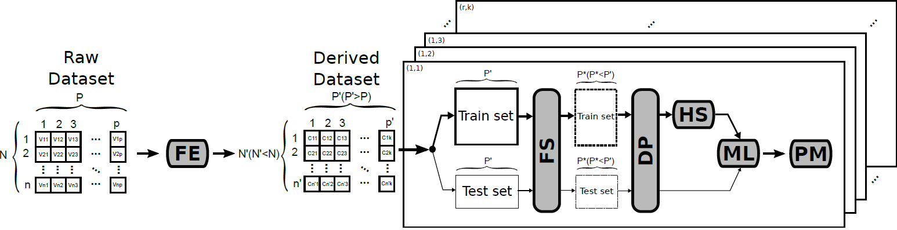

Description
------------
ff4ml shows a framework that implements the proposed methodology validating its suitability, to evaluate and compare NIDS approaches ML-based.

All experimentation has been carried out on a suitable dataset, UGR'16. The comparisons are made with studies by other authors in [MSNM](https://ieeexplore.ieee.org/document/8628992). 

## Installation

#### Requirements

FF4ml runs with python 3.6 and has been successfully tested on Ubuntu from 18.04 version and above. Also, the following dependencies has to be installed.

* numpy>=1.16.5
* pandas>=0.25.1
* scikit-learn>=0.21.3
* scikit-optimize>=0.5.2

#### How to install
Without a doubt, the best way to execute this development is through a Python execution environment. That is why it is recommended to create one before beginning the installation of the requirements. Thus, we recommend using Anaconda as an aid in this process. 

The steps to follow if you want to use this environment are the following:

    $ conda create -n ff4ml python=3.6 
    $ conda activate ff4ml

Once the Anaconda environment has been created, and having been logged in, to install all the necessary requirements for the execution of our projects, it will be enough to execute the following instruction:

    (ff4ml) $ pip install -r requirements.txt

#### How to run an example

To run an example, once the runtime environment is configured, the first thing to do is make sure that the source data sets are in the corresponding folder. To do this you must download the 'data' folder, from this repository to the '/ home' where it will run. Subsequently, the file 'main.py' must be executed, to which three arguments must be offered: model, repetition number and kfold number.

* Model: lr, rf, svc. These correspond, respectively, to Logistic Regression, Random Forest and Support Vector Machine. (See paper to learn how the parameters have been chosen).

* Repeat number: up to 20 repetitions have been implemented, so a number from 1 to 20 must be provided.

* Kfold: 5 kfold have been implemented, so a 1-5 number must be provided.

A possible example of execution would be like this:

    $ python main.py lr 2 3

What would it mean for repetition 2 of kfold 3 to be executed for the Logistic Regression model

